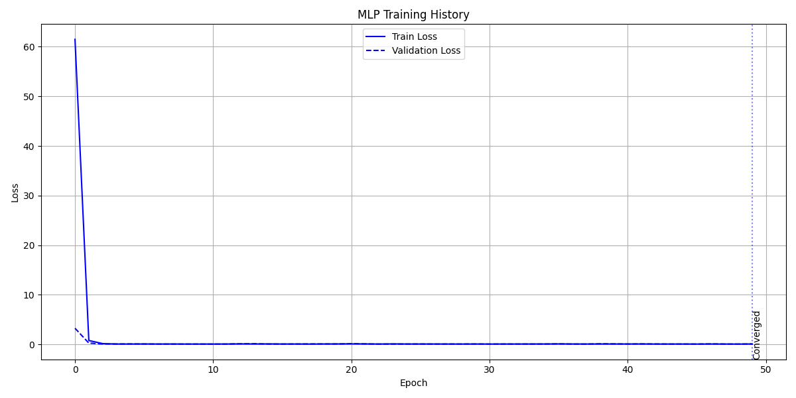
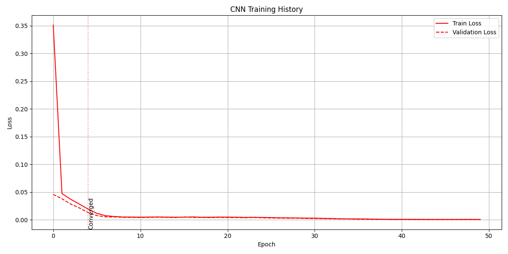
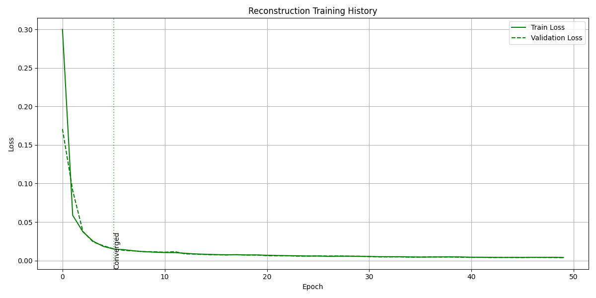
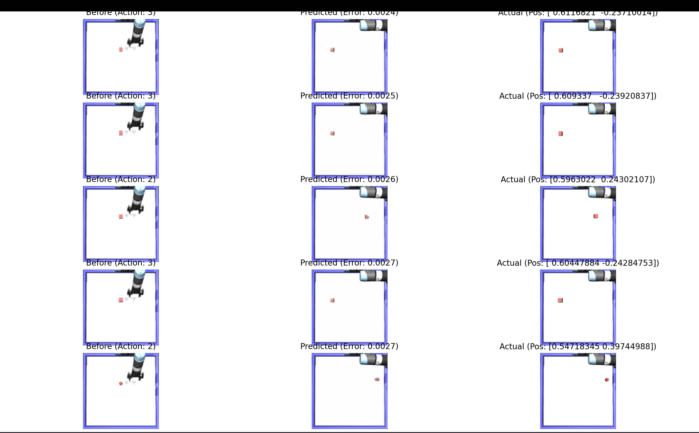

# CMPE591 Homework 1 - Push Dataset Learning

This project implements three different approaches (MLP, CNN, and Image Reconstruction) for learning from a push dataset.

## Project Structure 

## How to Run

1. First, collect the push dataset:

2. Create train/validation splits:
```bash
python create_splits.py
```
This will generate `data_splits.pt`

3. Train each model:

MLP Model:
```bash
python hw1_mlp.py --mode train
```

Generates:
- mlp_losses.pt
- mlp_model.pth

CNN Model:
```bash
python hw1_cnn.py --mode train
```

Generates:
- cnn_losses.pt
- cnn_model.pth

Reconstruction Model:
```bash cmpe591-hw1/README.md
python hw1_reconstruction.py --mode train
```

Generates:
- reconstruction_losses.pt
- reconstruction_model.pth

You can also Test via settin mode to test
```bash cmpe591-hw1/README.md
python hw1_reconstruction.py --mode test
```

4. View some reconstruction results:
```bash
python visualize_results.py
```

Generates:
- visualisation.png

5. Plot model losses convergence:
```bash
python plot_losses.py
```

https://drive.google.com/drive/folders/1Qi-O6pLWszN3w543WrxfueQTU0gGyXNJ?usp=sharing
here there is mlp and cnn models in this link. 

Shows separate training history plots for each model.

## Mlp Loss



## Cnn Loss



## Reconstruction Loss



## Some examples for part 3



